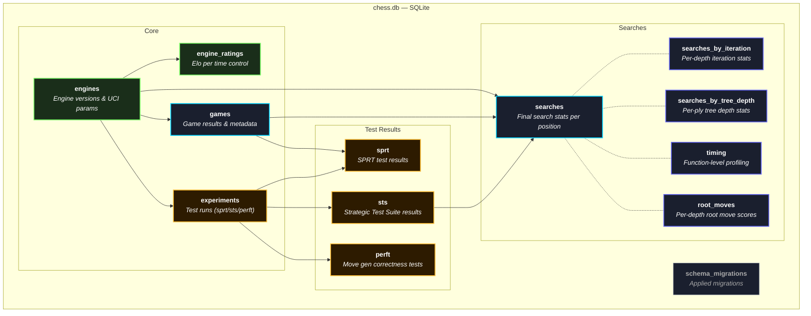
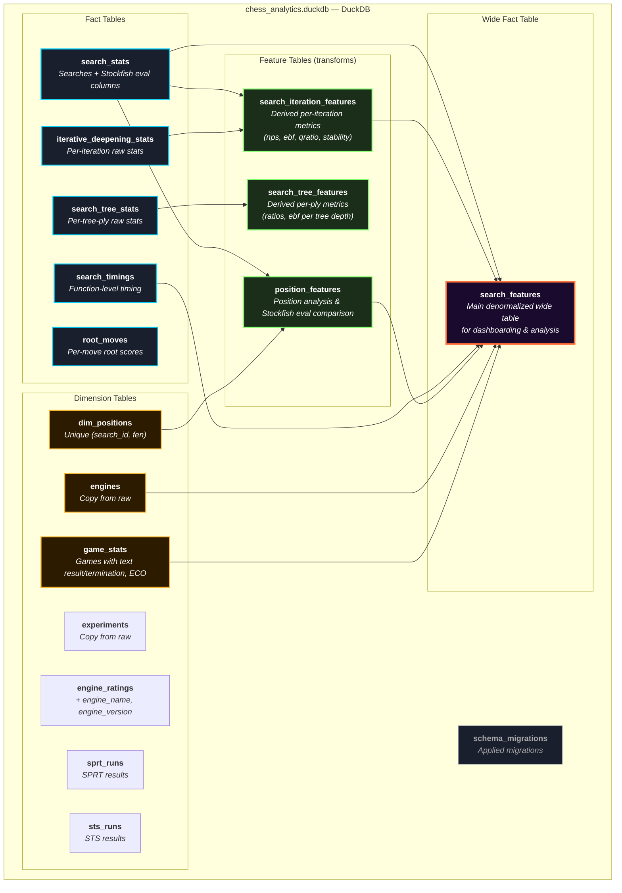

# Database Schemas

## Raw Layer — SQLite (`chess.db`)

| Group | Tables | Row Scale |
|-------|--------|-----------|
| Core entities | `engines`, `experiments`, `engine_ratings` | 10s |
| Game data | `games` | 1000s |
| Search data | `searches`, `searches_by_iteration`, `searches_by_tree_depth`, `timing`, `root_moves` | 100k+ |
| Test results | `sprt`, `sts`, `perft` | 100s |

Arrows indicate foreign-key direction (parent → child).

---

## Analytics Layer — DuckDB (`chess_analytics.duckdb`)

| Layer | Tables | Purpose |
|-------|--------|---------|
| Dimensions (7) | `engines`, `experiments`, `engine_ratings`, `game_stats`, `dim_positions`, `sprt_runs`, `sts_runs` | Context/lookup tables |
| Facts (5) | `search_stats`, `iterative_deepening_stats`, `search_tree_stats`, `search_timings`, `root_moves` | Raw search measurement data |
| Features (3) | `position_features`, `search_iteration_features`, `search_tree_features` | Derived metrics via Python + SQL transforms |
| Wide Fact (1) | `search_features` | Denormalized join of all above — primary dashboard source |

Arrows indicate data flow into derived tables.
