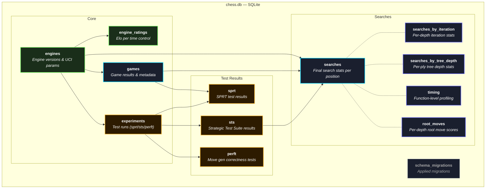
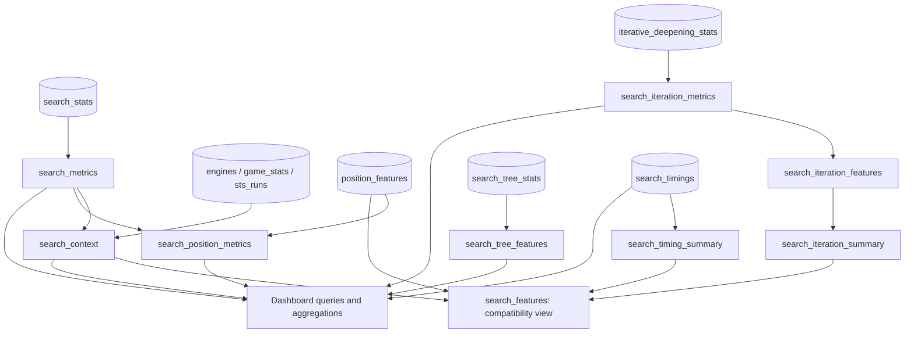

# Database Schemas

## Raw Layer — SQLite (`chess.db`)

```mermaid
graph TD
    subgraph Raw["chess.db — SQLite"]

        subgraph Core["Core"]
            ENG["<b>engines</b><br/><i>Engine versions & UCI params</i>"]
            RAT["<b>engine_ratings</b><br/><i>Elo per time control</i>"]
            EXP["<b>experiments</b><br/><i>Test runs (sprt/sts/perft)</i>"]
            GAM["<b>games</b><br/><i>Game results & metadata</i>"]
        end

        subgraph SearchLayer["Searches"]
            SEA["<b>searches</b><br/><i>Final search stats per position</i>"]
            SBI["<b>searches_by_iteration</b><br/><i>Per-depth iteration stats</i>"]
            SBT["<b>searches_by_tree_depth</b><br/><i>Per-ply tree depth stats</i>"]
            TIM["<b>timing</b><br/><i>Function-level profiling</i>"]
            RM["<b>root_moves</b><br/><i>Per-depth root move scores</i>"]
        end

        subgraph Tests["Test Results"]
            SPRT["<b>sprt</b><br/><i>SPRT test results</i>"]
            STS["<b>sts</b><br/><i>Strategic Test Suite results</i>"]
            PERFT["<b>perft</b><br/><i>Move gen correctness tests</i>"]
        end

        MIG["<b>schema_migrations</b><br/><i>Applied migrations</i>"]

        ENG --> RAT
        ENG --> EXP
        ENG --> GAM
        ENG --> SEA
        GAM --> SEA
        GAM --> SPRT
        STS --> SEA

        EXP --> SPRT
        EXP --> STS
        EXP --> PERFT

        SEA -..- SBI
        SEA -..- SBT
        SEA -..- TIM
        SEA -..- RM
    end

    style ENG fill:#1a2e1a,stroke:#7fff6b,stroke-width:2px,color:#fff
    style SEA fill:#1a1f2e,stroke:#00d2ff,stroke-width:2px,color:#fff
    style GAM fill:#1a1f2e,stroke:#00d2ff,stroke-width:2px,color:#fff
    style EXP fill:#2d1b00,stroke:#f7b731,stroke-width:2px,color:#fff
    style SPRT fill:#2d1b00,stroke:#f7b731,stroke-width:2px,color:#fff
    style STS fill:#2d1b00,stroke:#f7b731,stroke-width:2px,color:#fff
    style PERFT fill:#2d1b00,stroke:#f7b731,stroke-width:2px,color:#fff
    style RAT fill:#1a2e1a,stroke:#7fff6b,stroke-width:2px,color:#fff
    style SBI fill:#1a1f2e,stroke:#6366f1,stroke-width:2px,color:#fff
    style SBT fill:#1a1f2e,stroke:#6366f1,stroke-width:2px,color:#fff
    style TIM fill:#1a1f2e,stroke:#6366f1,stroke-width:2px,color:#fff
    style RM fill:#1a1f2e,stroke:#6366f1,stroke-width:2px,color:#fff
    style MIG fill:#1a1f2e,stroke:#8892a4,stroke-width:1px,color:#aaa
```

| Group | Tables | Row Scale |
|-------|--------|-----------|
| Core entities | `engines`, `experiments`, `engine_ratings` | 10s |
| Game data | `games` | 1000s |
| Search data | `searches`, `searches_by_iteration`, `searches_by_tree_depth`, `timing`, `root_moves` | 100k+ |
| Test results | `sprt`, `sts`, `perft` | 100s |

Arrows indicate foreign-key direction (parent → child).

---

## Analytics Layer — DuckDB (`chess_analytics.duckdb`)

Stored facts remain at their original grain. SQL views calculate metrics and
join metadata when queried; the pipeline no longer builds a wide fact table.

```mermaid
flowchart TD
    S[(search_stats)] --> M[search_metrics]
    M --> C[search_context]
    E[(engines / game_stats / sts_runs)] --> C
    M --> P[search_position_metrics]
    PF[(position_features)] --> P
    I[(iterative_deepening_stats)] --> IM[search_iteration_metrics]
    IM --> IF[search_iteration_features]
    IF --> IS[search_iteration_summary]
    T[(search_tree_stats)] --> TF[search_tree_features]
    ST[(search_timings)] --> TS[search_timing_summary]
    C --> COMP[search_features: compatibility view]
    PF --> COMP
    IS --> COMP
    TS --> COMP
    M --> DASH[Dashboard queries and aggregations]
    C --> DASH
    P --> DASH
    IM --> DASH
    TF --> DASH
    ST --> DASH
```

| Relation | Storage / grain | Purpose |
|---|---|---|
| `search_stats` | Table: search ID | Search facts and stored Stockfish evaluations |
| `iterative_deepening_stats` | Table: search ID + iteration depth | Iteration facts |
| `search_tree_stats` | Table: search ID + tree depth | Tree facts |
| `search_timings` | Table: search ID + function | Timing facts |
| `root_moves` | Table: recorded root move ID | Root move observations |
| `engines`, `experiments`, `engine_ratings`, `game_stats`, `sprt_runs`, `sts_runs` | Tables at their source entity grain | Metadata and results |
| `dim_positions`, `position_features` | Tables: search ID | Position inputs and expensive Python analysis |
| `search_metrics` | View: search ID | Ratios, totals, aliases, evaluation difference; no joins |
| `search_context` | View: search ID | Metrics with engine, game, and STS metadata |
| `search_position_metrics` | View: search ID | Metrics with stored position analysis |
| `search_iteration_metrics` | View: search ID + iteration depth | Counters and ratios without windows |
| `search_iteration_features` | View: search ID + iteration depth | Metrics with branching and stability windows |
| `search_tree_features` | View: search ID + tree depth | Tree ratios and branching factors |
| `search_iteration_summary` | View: search ID | Aggregated iteration features, for consumers that need them |
| `search_timing_summary` | View: search ID | Timing pivot, for compatibility consumers |
| `search_features` | View: search ID | Compatibility join for existing notebooks/scripts |

The compatibility view aggregates each child relation before joining, so
iterations and timing functions do not multiply search counts. Metadata IDs
and `position_features.search_id` must remain unique. Dashboard queries use
focused views, and timing/root-move tabs query their fact tables directly.

See [OLAP migration](olap-migration.md) for commands, metric definitions,
validation, and refresh/performance limitations.
