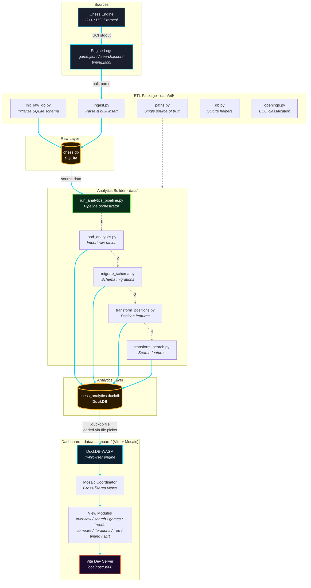

```mermaid
graph TD
    subgraph Sources["Sources"]
        ENG["Chess Engine<br/><i>C++ / UCI Protocol</i>"]
        LOGS["Engine Logs<br/><i>game.jsonl / search.jsonl / timing.jsonl</i>"]
    end

    subgraph ETL["ETL Package · data/etl/"]
        RAW["init_raw_db.py<br/><i>Initialize SQLite schema</i>"]
        ING["ingest.py<br/><i>Parse & bulk insert</i>"]
        PATHS["paths.py<br/><i>Single source of truth</i>"]
        DB["db.py<br/><i>SQLite helpers</i>"]
        OPEN["openings.py<br/><i>ECO classification</i>"]
    end

    subgraph Raw["Raw Layer"]
        SQLITE[("chess.db<br/><b>SQLite</b>")]
    end

    subgraph Builder["Analytics Builder · data/"]
        RUN["run_analytics_pipeline.py<br/><i>Pipeline orchestrator</i>"]

        LOAD["load_analytics.py<br/><i>Import raw tables</i>"]
        MIG["migrate_schema.py<br/><i>Schema migrations</i>"]
        TP["transform_positions.py<br/><i>Position features</i>"]
        TS["transform_search.py<br/><i>Search features</i>"]

        RUN -.->|"1"| LOAD
        LOAD -.->|"2"| MIG
        MIG -.->|"3"| TP
        TP -.->|"4"| TS
    end

    subgraph Analytics["Analytics Layer"]
        DUCK[("chess_analytics.duckdb<br/><b>DuckDB</b>")]
    end

    subgraph Dashboard["Dashboard · data/dashboard/ (Vite + Mosaic)"]
        DKWASM["DuckDB-WASM<br/><i>In-browser engine</i>"]
        MOSAIC["Mosaic Coordinator<br/><i>Cross-filtered views</i>"]
        VIEWS["View Modules<br/><i>overview / search / games / trends<br/>compare / iterations / tree / timing / sprt</i>"]
        APP["Vite Dev Server<br/><i>localhost:3000</i>"]
    end

    ENG -->|"UCI stdout"| LOGS
    LOGS -->|"bulk parse"| ING
    RAW --> SQLITE
    ING --> SQLITE

    SQLITE -->|"source data"| RUN

    LOAD --> DUCK
    MIG --> DUCK
    TP --> DUCK
    TS --> DUCK

    DUCK -->|".duckdb file<br/>loaded via file picker"| DKWASM
    DKWASM --> MOSAIC
    MOSAIC --> VIEWS
    VIEWS --> APP

    PATHS -.-> Builder

    style ENG fill:#1a1f2e,stroke:#00d2ff,stroke-width:2px,color:#e8eaf0
    style LOGS fill:#1a1f2e,stroke:#00d2ff,stroke-width:2px,color:#e8eaf0
    style SQLITE fill:#2d1b00,stroke:#f7b731,stroke-width:3px,color:#fff
    style DUCK fill:#2d1b00,stroke:#f7b731,stroke-width:3px,color:#fff
    style DKWASM fill:#0a1e2e,stroke:#00d2ff,stroke-width:2px,color:#fff
    style APP fill:#1a0a2e,stroke:#ff6b35,stroke-width:3px,color:#fff
    style RUN fill:#0a2e1a,stroke:#7fff6b,stroke-width:3px,color:#fff

    linkStyle 4,5,6,7,8,9,10,11,12,13,14,15,16 stroke:#00d2ff,stroke-width:2.5px
    linkStyle 0,1,2,3,17 stroke:#8892a4,stroke-width:1.5px,stroke-dasharray:5
```